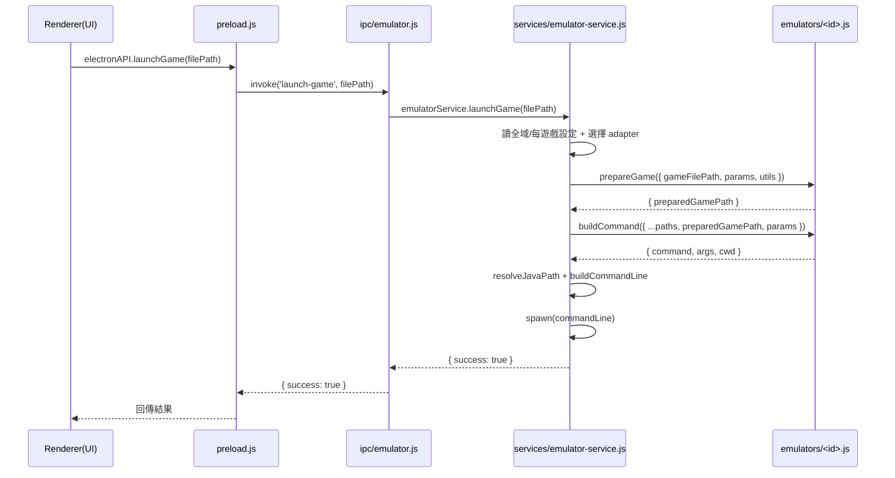

# 模擬器適配器整合指南

本指南總結了 J2ME-Launcher 模擬器適配器的運行邏輯、呼叫時序、配置結構，以及如何新增一個適配器的步驟與模板。

---

## 架構與分層

- **主進程 IPC**：`src/main/ipc/emulator.js`
  - 註冊與暴露與模擬器相關的 IPC：列舉模擬器、讀寫配置、挑選可執行檔/核心、啟動遊戲。
  - 動態適配器註冊：透過 `adapters` 參數傳入，內部統一使用 `adapterList` 與 `adapterMap` 進行列舉與查找。
- **啟動服務**：`src/main/services/emulator-service.js`
  - 單一入口 `createEmulatorService().launchGame(gameFilePath)`。
  - 讀取全域與每遊戲配置，選擇對應 `adapter`，呼叫 `prepareGame()` 與 `buildCommand()`，最後 `spawn`。
  - 保留 `freej2mePlus` 的參數合併與 `game.conf` 更新行為，並對 `ke`/`libretro` 提供友好錯誤訊息。
- **適配器**：`src/main/emulators/`
  - 每個檔案對應一個 emulator adapter（如 `freej2mePlus.js`、`ke.js`、`libretro.js`）。
  - 實作統一的 adapter 介面（見下）。
- **配置服務**：`src/main/config/yaml-config.js`
  - 管理 YAML 全域設定、預設值與驗證；對未知鍵採用合併保留策略。
- **資料存取**：`DataStore` + `src/main/sql/emulator-configs.js`
  - 存取每遊戲的模擬器覆寫設定；`DataStore.getGameEmulatorConfig(gameFilePath)` 供服務層讀取。

---

## 呼叫時序圖



---

## Adapter 介面契約

每個適配器需導出以下成員：

- **`id: string`**
  - 唯一 ID，與配置鍵一致（例：`freej2mePlus`、`ke`、`libretro`）。
- **`name: string`**
  - 顯示名稱。
- **`capabilities: object`**
  - 範例：`{ perGameParams: boolean, requiresGameConf: boolean, supportsAssets: string[] }`。
- **`async prepareGame(ctx)`**（可選但建議實作）
  - 入參：`{ jarPath?, retroarchPath?, corePath?, gameFilePath, params?, utils }`。
  - 可進行 JAR MD5 快取、`game.conf` 更新等前置處理。
  - 返回：`{ preparedGamePath: string }`。
- **`buildCommand(ctx)`**（必須）
  - 入參：`{ jarPath?, retroarchPath?, corePath?, gameFilePath, params? }`。
  - 返回：`{ command: string, args: string[], cwd?: string }`。
- **`getConfigSchema()`**（可選）
  - 提供給 UI 用的設定 Schema，以動態渲染設定面板。
- **`getPickFilters(type)`**（可選）
  - 返回檔案挑選器的過濾器，如 `{ name: 'My Emulator', extensions: ['exe'] }`。

服務層會：

- 自動決定是否使用 `utils.ensureCachedJar`（依 `romCache`）。
- 若 `command === 'java'`，以 `ConfigService.resolveJavaPath()` 解析實際 Java 指令。
- 使用 `buildCommandLine()` 處理引號與組裝命令行後 `spawn`。
- 對 `-Dfile.encoding=ISO_8859_1` 採用預先加引號的特例，再交由 `buildCommandLine()` 處理，以確保 Java 參數解析正確。

---

## 運行邏輯（服務層重點）

- **選擇適配器**：
  - 每遊戲：`perGame.emulator || perGame.selectedEmulator`，舊值 `'kemulator'` 會映射為 `'ke'`。
  - 回退：若找不到對應 `adapter`，回退到 `freej2mePlus` 或第一個可用適配器。
- **配置合併**：
  - 全域：`DataStore.getEmulatorConfig()` 來自 YAML（見下）。
  - 每遊戲：`DataStore.getGameEmulatorConfig(gameFilePath)` 返回可覆寫的 JSON。
- **`romCache` 規則**：
  - 每遊戲 > 全域 > 預設 `false`（各適配器可在 YAML 預設中設置為 `true`）。
  - 實際 YAML 預設中，`freej2mePlus` 與 `ke` 已為 `true`，`libretro` 為 `false`。
- **友好錯誤（保留行為）**：
  - `ke`：缺 `jarPath` 或檔案不存在。
  - `libretro`：缺 `retroarchPath`、`corePath` 或檔案不存在。
  - `freej2mePlus`：缺 `jarPath` 或檔案不存在。
- **FreeJ2ME-Plus 參數**：
  - 保留合併規則：
    - `useGlobal !== false` 則取全域 `defaults`；否則取每遊戲 `params`。
    - 追加全域 `textfont`/`soundfont` 到 `params`，並寫入 `game.conf`。

---

## YAML 全域配置與每遊戲覆寫

來源：`src/main/config/yaml-config.js`。

- **全域 YAML 結構（節選）**：

```yaml
version: 1
emulators:
  freej2mePlus:
    jarPath: '' # FreeJ2ME-Plus 的 JAR 路徑
    romCache: true
    defaults:
      fullscreen: 0
      width: 240
      height: 320
      scale: 2
      keyLayout: 0
      framerate: 60
      # 兼容與擴展項（僅節選）
      backlightcolor: Disabled
      fontoffset: 0
      rotate: 0
      fpshack: Disabled
      sound: on
      spdhacknoalpha: off
      compatfantasyzonefix: off
      compatimmediaterepaints: off
      compatoverrideplatchecks: on
      compatsiemensfriendlydrawing: off
      compattranstooriginonreset: off
      textfont: Default
      soundfont: Default
  ke:
    jarPath: ''
    romCache: true
  libretro:
    retroarchPath: ''
    corePath: ''
    romCache: false
  squirreljme:
    jarPath: ''
    romCache: true
ui:
  defaultView: desktop
  showUncategorized: true
  folderLayout: grid
```

- **每遊戲覆寫（由 SQLite 儲存，以下為服務層使用形態）**：

```json
{
  "emulator": "freej2mePlus", // 或 "selectedEmulator"
  "freej2mePlus": {
    "useGlobal": true,
    "romCache": true,
    "params": { "width": 240, "height": 320 }
  },
  "ke": { "romCache": true },
  "squirreljme": { "romCache": true },
  "libretro": { "romCache": false }
}
```

> 註：服務層僅依賴鍵名與布林/數值等基本類型；額外鍵不會被刪除。

---

## 動態註冊/分派設計

- **`ipc/emulator.js`**
  - `register({ ..., adapters })` 可接收陣列型態的適配器，內部建立 `adapterList` 與 `adapterMap`。
  - `list-emulators`/`get-emulator-capabilities`/`get-emulator-schema` 皆從 `adapterList`/`adapterMap` 取得，無需硬編碼。
  - `pick-emulator-binary` 針對 `libretro-exe`/`libretro-core` 提供現有過濾器；若傳入的是 adapter id 且實作 `getPickFilters('binary')`，則會使用該過濾器。
- **`emulator-service.js`**
  - `adapters` 為以 `id` 為鍵的物件，透過 `selectedEmulator` 查找 adapter。
  - 對既有三種適配器保留必填路徑檢查與錯誤訊息；其餘走通用流程。

---

## 如何新增一個適配器

1. **新增檔案**：`src/main/emulators/<newId>.js`
   - 導出：
     - `id`, `name`, `capabilities`
     - `async prepareGame(ctx)`（可選，建議）
     - `buildCommand(ctx)`（必須）
     - `getConfigSchema?()`, `getPickFilters?(type)`（可選）
2. **在主進程註冊**：`src/main/main.js`
   - 引入新檔案：
     ```js
     const newAdapter = require('./emulators/<newId>.js');
     ```
   - 傳入 IPC 註冊：
     ```js
     registerEmulatorIpc({
       ipcMain,
       dialog,
       DataStore,
       freej2mePlusAdapter,
       keAdapter,
       libretroAdapter,
       squirreljmeAdapter,
       configService,
       getConfigGameName,
       app,
       adapters: [freej2mePlusAdapter, keAdapter, libretroAdapter, squirreljmeAdapter, newAdapter],
     });
     ```
3. **（可選）全域 YAML 預設**：`src/main/config/yaml-config.js`
   - 若需要預設值（如 `romCache: true` 或必要路徑鍵），可在 `DEFAULTS.emulators.<newId>` 補上。
   - 未補上也無妨，未知鍵會被保留；但 UI/驗證與預設體驗可能較弱。
4. **（可選）每遊戲覆寫**
   - 服務層已支援 `perGame[<newId>]` 的結構（例如 `{ romCache, params }`）。
   - 若有專屬 per-game 欄位，建議在 `getConfigSchema()` 提供 UI Schema 以便前端渲染。

---

## 適配器模板（範例）

```js
// src/main/emulators/sample.js
const id = 'sample';
const name = 'Sample Emulator';
const capabilities = {
  perGameParams: false,
  requiresGameConf: false,
  supportsAssets: [],
};

async function prepareGame({ gameFilePath, utils }) {
  // 可選：做快取或預處理
  // 例如：utils.ensureCachedJar && await utils.ensureCachedJar(gameFilePath)
  return { preparedGamePath: gameFilePath };
}

function buildCommand({ gameFilePath }) {
  // 構建命令行
  const command = 'my-emulator.exe';
  const args = [gameFilePath];
  const cwd = undefined; // 如需指定工作目錄
  return { command, args, cwd };
}

function getConfigSchema() {
  return {
    id,
    fields: [
      { key: 'exePath', label: 'Executable', type: 'file', required: false },
      { key: 'romCache', label: 'ROM Cache', type: 'boolean', required: false },
    ],
  };
}

function getPickFilters(type) {
  if (type === 'binary') return { name: 'Executable', extensions: ['exe'] };
  return null;
}

module.exports = {
  id,
  name,
  capabilities,
  prepareGame,
  buildCommand,
  getConfigSchema,
  getPickFilters,
};
```

---

## 測試清單

- **列舉與能力**：
  - `list-emulators` 能看到新 `id/name/capabilities`。
  - 若實作 `getConfigSchema()`，前端能渲染設定表單。
- **挑選器**：
  - 若實作 `getPickFilters('binary')`，`pick-emulator-binary` 能使用對應過濾器。
- **啟動流程**：
  - 全域設定與每遊戲覆寫能影響 `romCache` 與 `params`。
  - `prepareGame()` 被呼叫且返回的 `preparedGamePath` 生效。
  - `buildCommand()` 返回的 `{ command, args, cwd }` 能正確被 `spawn`。

---

## 疑難排解

- **未找到適配器**：
  - 確認 `main.js` 的 `registerEmulatorIpc({ adapters: [...] })` 有包含新適配器。
- **缺少必填路徑**：
  - 針對 `ke`/`libretro`/`freej2mePlus`/`squirreljme`/`freej2meZb3` 已有友好提示；新適配器建議在 `buildCommand()` 前自行檢查並丟出明確錯誤。
- **Java 問題**：
  - 若 `buildCommand().command === 'java'`，會使用 `ConfigService.resolveJavaPath()`；請確保系統環境或設定正確。

---

## 參考檔案

- `src/main/ipc/emulator.js`
- `src/main/services/emulator-service.js`
- `src/main/emulators/freej2mePlus.js`
- `src/main/emulators/ke.js`
- `src/main/emulators/libretro.js`
- `src/main/emulators/squirreljme.js`
- `src/main/emulators/freej2meZb3.js`
- `src/main/config/yaml-config.js`
- `src/main/preload.js`
